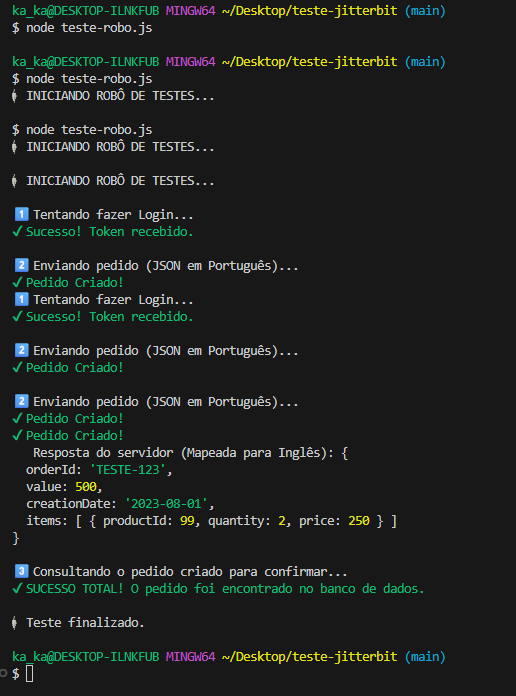

# Desafio Técnico - API de Pedidos (Node.js)

Este projeto é uma API REST desenvolvida como parte do teste técnico para a **Jitterbit**. A aplicação gerencia pedidos, realiza transformação de dados (Mapping de JSON) e implementa segurança com JWT.

## 🚀 Funcionalidades

- **Criação de Pedidos:** Recebe um JSON em Português, transforma os dados e tipos (String -> Number) e salva em formato padrão de banco de dados (Inglês).
- **Leitura de Pedidos:** Busca pedidos pelo ID.
- **Segurança:** Autenticação via Token JWT (JSON Web Token).
- **Documentação:** Interface interativa via Swagger UI.
- **Testes Automatizados:** Script de robô para validar o fluxo completo.

## 🛠️ Tecnologias Utilizadas

- **Node.js** & **Express**
- **JWT** (Autenticação)
- **Swagger UI** (Documentação)
- **Git** (Versionamento)

---

## ⚙️ Como Rodar o Projeto

### 1. Pré-requisitos
Certifique-se de ter o [Node.js](https://nodejs.org/) instalado em sua máquina.

### 2. Instalação
Clone o repositório e instale as dependências:

```bash
# Instalar dependências
npm install
```

### 3. Executando a API
Inicie o servidor localmente:

```bash
node server.js
```
O servidor rodará em `http://localhost:3000`.

---

## 📖 Documentação (Swagger)

Com o servidor rodando, acesse a documentação interativa para testar as rotas manualmente:

👉 **[http://localhost:3000/api-docs](http://localhost:3000/api-docs)**

1. Utilize a rota `/login` para gerar um token.
2. Clique no botão **Authorize** no topo da página e insira `Bearer SEU_TOKEN`.
3. Teste as demais rotas (`/order`).

---

## 🎥 Demonstração Visual

Veja o sistema funcionando na prática (Teste manual via Swagger):


## 🤖 Executando o Teste Automatizado (Robô)

Foi desenvolvido um script de teste que simula um cliente real. Ele executa as seguintes ações automaticamente:
1. Faz login e obtém o Token JWT.
2. Envia um pedido com campos em Português.
3. Verifica se a API transformou os dados corretamente (Mapping).
4. Consulta o banco de dados para garantir que o pedido foi salvo.

**Para rodar o teste:**
Mantenha o servidor rodando em um terminal, abra um **segundo terminal** e execute:

```bash
node teste-robo.js
```

**Saída esperada:**
Você verá logs coloridos (verdes) confirmando o sucesso de cada etapa da operação.



---

## 📋 Estrutura do Mapping

A API realiza a seguinte transformação de dados (De -> Para):

**Entrada (JSON Cliente):**
```json
{
  "numeroPedido": "v100...",
  "items": [
    { "idItem": "2434" }  // String
  ]
}
```

**Saída (Banco de Dados):**
```json
{
  "orderId": "v100...",
  "items": [
    { "productId": 2434 } // Number (Integer)
  ]
}
